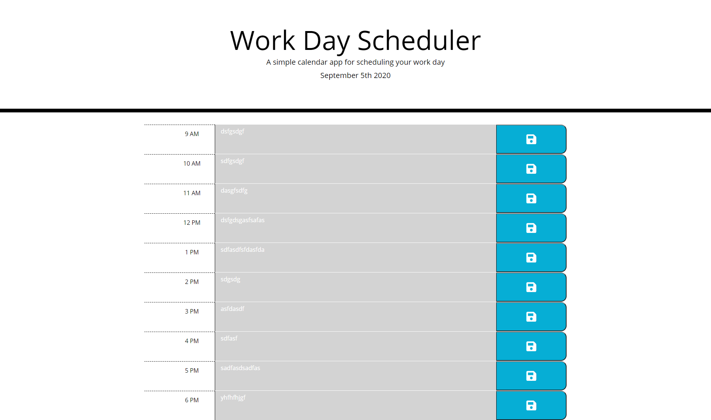

# Hourlyplanner

The quizgame application is created using 

* Utilization of third party API's such as Bootstrap and Jquery to have
consistent coding structure and simpler formatting 
* Localstorage functions to hold scores (This time using objects as opposed to 
arrays due to multiple properties to one object)
* Ability to use moment.js within code to validate, parse, manipulate and display dates (Used to not only show date at the top of the html, but also to compare property id's with individual time blocks to activate certain functions and fill back in textarea)

## Example snapshots and Usage
When the day starts using moment.js the blocks will undergo the timeMatch function which will add in new style classes to the textarea. If in the past the divs will turn grey, if in the future the divs will turn green and if in the current hour the div will turn red. 

* Insert image here

The tasks can be inputed into the textarea and the inputs can then be saved via click function on the save icon to the right of the textarea which will be uploaded into local storage.

* Insert image here

Once the time is outside of the range of the timeblocks (Over 6pm) the divs will turn grey with the present class being added to them.

## Links to the project
You can find this linked at https://aznjp.github.io/Hourlyplanner/